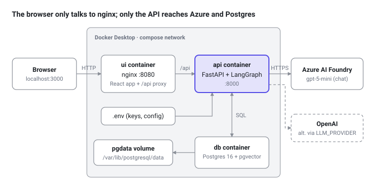
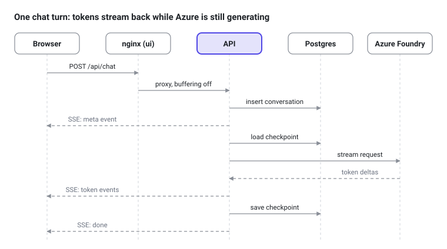

# Foundry Chatbot — Architecture & Design

As of 2026-09-25 · Exported from the [living doc](https://claude.ai/code/artifact/7607dd94-74d0-44cb-b2d6-f2525b52c005)

## Overview

The chatbot runs as three containers on Docker Desktop: a React UI, a FastAPI + LangGraph API, and Postgres with pgvector. The API talks to Azure AI Foundry today (deployment `gpt-5-mini`), and can switch to OpenAI through `.env`.

- **Working now:** streamed chat, per-conversation memory, conversation history in a sidebar, markdown rendering.
- **Waiting on config:** document upload and retrieval (RAG) turn on once an embedding deployment is set in `AZURE_OPENAI_EMBEDDING_DEPLOYMENT`.
- **Out of scope for now:** login, Kubernetes manifests, CI/CD. The containers are already built to move to a cluster later.

## Architecture



The UI container serves the React app and forwards every `/api` call to the API container, so the browser never calls the API or Azure directly. The dashed OpenAI path is the alternate provider, selected with `LLM_PROVIDER`.

## UI components

The UI is a React 18 + TypeScript app built by Vite and served as static files by unprivileged nginx on port 8080. There is no global state library: `App.tsx` holds all state and passes it down as props.

| Component | File | Responsibility |
| --- | --- | --- |
| App | `src/App.tsx` | Holds conversations, messages, documents, active conversation, streaming flag; wires every handler |
| Sidebar | `src/components/Sidebar.tsx` | New chat, conversation list (title + relative time, delete), document list |
| UploadButton | `src/components/UploadButton.tsx` | File picker for .pdf/.txt/.md, busy state; hidden when `rag_enabled` is false |
| ChatWindow | `src/components/ChatWindow.tsx` | Message list, empty state, auto-scroll unless the user scrolled up |
| MessageBubble | `src/components/MessageBubble.tsx` | User text as plain text; assistant text as Markdown (GFM + highlight.js), copy button on code blocks, no raw HTML |
| Composer | `src/components/Composer.tsx` | Textarea (Enter sends, Shift+Enter newline), Send / Stop buttons |
| API client | `src/api/client.ts` | `fetch` wrappers for every endpoint and the SSE stream parser |
| nginx config | `nginx/default.conf.template` | Serves the bundle with SPA fallback; proxies `/api/` to `${API_UPSTREAM}` with buffering off |

The bundle has no API URL baked in: every call uses the relative path `/api`. In development, the Vite dev server proxies `/api` to `localhost:8000` the same way.

## API components

The API is a FastAPI app on Python 3.12 whose startup builds one LangGraph agent and shares it with every request. Only `llm.py` knows which model provider is in use.

| Module | File | Responsibility |
| --- | --- | --- |
| App + lifespan | `app/main.py` | Validates provider config, opens the Postgres pool, sets up the checkpointer and `conversations` table, builds the vector store and graph |
| Settings | `app/config.py` | Reads env vars / `.env` (pydantic-settings), resolves the provider, normalizes a Foundry project URL to the resource root |
| Model factory | `app/llm.py` | `get_chat_model()` and `get_embeddings()` for Azure or OpenAI |
| Vector store | `app/vectorstore.py` | `PGVector` store (langchain-postgres) on the `documents` collection |
| Agent graph | `app/graph.py` | `create_react_agent` with the `retrieve_documents` tool and the system prompt; no tool when RAG is off |
| Ingestion | `app/ingest.py` | PDF/TXT/MD load, 1,000-character chunks with 150 overlap, embed and store with `document_id` + `source` metadata |
| Dependencies | `app/deps.py` | Hands the pool, graph, checkpointer and vector store to routes; the single place to add auth later |
| Chat router | `app/routers/chat.py` | `POST /api/chat`, streams the agent's tokens as SSE |
| Conversations router | `app/routers/conversations.py` | List, read messages, delete |
| Documents router | `app/routers/documents.py` | Upload, list, delete |
| Health router | `app/routers/health.py` | `/api/healthz` (liveness + provider + `rag_enabled`), `/api/readyz` (DB check) |

The agent follows the ReAct loop: the model either answers or calls `retrieve_documents`, which runs a similarity search (top 4 chunks) and returns the text with source filenames for citation.

## UI ↔ API communication

The UI calls the API only through nginx at the relative path `/api`, as JSON over HTTP; chat replies come back as server-sent events (SSE) on the same POST response. nginx forwards `/api/` to `http://api:8000` on the compose network, so the browser needs no CORS and no API hostname.

| Method | Path | Used by | Returns |
| --- | --- | --- | --- |
| POST | `/api/chat` | Composer send | SSE stream (see below) |
| GET | `/api/conversations` | Sidebar load / refresh | `[{id, title, created_at, updated_at}]`, newest first |
| GET | `/api/conversations/{id}/messages` | Selecting a conversation | `[{role, content}]` |
| DELETE | `/api/conversations/{id}` | Sidebar delete | 204 |
| POST | `/api/documents` | Upload button (multipart `file`) | `{document_id, source, chunks}`; 413 / 415 / 422 / 503 on errors |
| GET | `/api/documents` | Sidebar load | `[{document_id, source, chunks}]` |
| DELETE | `/api/documents/{id}` | Document delete | 204 |
| GET | `/api/healthz` | UI start (reads `rag_enabled`); container health check | `{status, provider, rag_enabled}` |
| GET | `/api/readyz` | Operators / future k8s readiness probe | `{status}` or 503 |



The request body is `{message, conversation_id?}`; without an id the API creates a conversation. Each SSE event is one `data: <json>` line followed by a blank line:

```
data: {"type":"meta","conversation_id":"<uuid>"}
data: {"type":"token","content":"Hel"}
data: {"type":"token","content":"lo"}
data: {"type":"done"}
data: {"type":"error","message":"..."}   (instead of done, on failure)
```

For every function involved in one chat turn, see [Chat request sequence](chat-request-sequence.md).

`EventSource` only supports GET, so `client.ts` reads the `fetch` response body with a stream reader and splits on blank lines. Streaming works end to end because nginx has `proxy_buffering off` and the API sends `X-Accel-Buffering: no`. The Stop button aborts the fetch with an `AbortController`.

## API ↔ Azure AI Foundry

The API calls Azure AI Foundry's OpenAI-compatible REST endpoint over HTTPS, authenticating with the `api-key` header from `.env`. It uses LangChain's `AzureChatOpenAI` (chat) and `AzureOpenAIEmbeddings` (embeddings), both created once at startup.

**Provider selection** (`app/config.py`), checked at startup:

1. `LLM_PROVIDER=azure` or `openai` in `.env` wins.
2. If it is empty: Azure when `AZURE_OPENAI_ENDPOINT` and `AZURE_OPENAI_API_KEY` are both set, otherwise OpenAI when `OPENAI_API_KEY` is set.
3. If neither is set, or Azure lacks `AZURE_OPENAI_CHAT_DEPLOYMENT`, the API exits and logs the missing variable names (never values).

**Endpoint.** `.env` holds the Foundry project URL (`https://<resource>.services.ai.azure.com/api/projects/proj-default`). A validator trims it to the resource root, `https://<resource>.services.ai.azure.com/`, which is what the OpenAI-compatible client needs.

| Setting | Current value | Used for |
| --- | --- | --- |
| `AZURE_OPENAI_ENDPOINT` | Foundry project URL, trimmed to resource root | Base URL |
| `AZURE_OPENAI_API_KEY` | set in `.env` (84 chars) | `api-key` request header |
| `AZURE_OPENAI_API_VERSION` | `2024-10-21` | `api-version` query parameter |
| `AZURE_OPENAI_CHAT_DEPLOYMENT` | `gpt-5-mini` | Chat calls |
| `AZURE_OPENAI_EMBEDDING_DEPLOYMENT` | not set | Embeddings; RAG is off until set |

**Calls made**

- Chat: `POST {root}/openai/deployments/gpt-5-mini/chat/completions?api-version=2024-10-21` with `stream: true`. LangGraph turns the streamed deltas into message chunks, and the chat router forwards only the agent node's text as SSE tokens.
- Embeddings (once configured): `POST {root}/openai/deployments/<embedding>/embeddings`, called on upload (per chunk batch) and on each retrieval query.

No network call happens at startup; the first Azure call is the first chat. An Azure error (bad key, missing deployment, throttling) reaches the UI as an SSE `error` event on that message. Verified on 2026-09-25: the key authenticated, the resource listed one deployment (`gpt-5-mini`), and a two-turn chat streamed 44 token events and kept memory across turns.

## Data layer

All state lives in one Postgres 16 database (`chatbot`) with the pgvector 0.8.6 extension, so the UI and API containers stay stateless. The API reaches it at `db:5432` through a psycopg connection pool (up to 10 connections).

| Table | Owner | Holds |
| --- | --- | --- |
| `conversations` | App (`main.py`) | One row per chat: `id` (UUID), `title` (first 60 chars of the first message), `created_at`, `updated_at` |
| `checkpoints`, `checkpoint_blobs`, `checkpoint_writes`, `checkpoint_migrations` | LangGraph `AsyncPostgresSaver` | Full message state per conversation, keyed by `thread_id` = conversation id |
| `langchain_pg_collection` | langchain-postgres | Vector collections (`documents`) |
| `langchain_pg_embedding` | langchain-postgres | One row per chunk: text, embedding vector, metadata (`document_id`, `source`, `page`) |

The message history shown in the UI is read from the LangGraph checkpoint, not a separate messages table. Deleting a conversation removes its row and its checkpoint thread; deleting a document removes every chunk with its `document_id`.

**Persistence.** The named Docker volume `pgdata` is mounted at `/var/lib/postgresql/data` in the `db` container. Data survives container rebuilds and `docker compose down`; only `docker compose down -v` deletes it. `db/init/01-extensions.sql` enables the `vector` extension the first time the volume is initialized.

## Deployment and configuration

One `docker-compose.yml` runs all three services on Docker Desktop, and `docker compose up --build -d` is the only command needed. Start order is enforced by health checks: `db` healthy → `api` healthy → `ui`.

| Service | Base image (Docker Hub) | Host → container port | Runs as | Health check |
| --- | --- | --- | --- | --- |
| `ui` | `node:22-alpine` (build) → `nginxinc/nginx-unprivileged:stable-alpine` | 3000 → 8080 | nginx (non-root) | — |
| `api` | `python:3.12-slim` | 8000 → 8000 | `appuser` (uid 10001) | `GET /api/healthz` every 15 s |
| `db` | `pgvector/pgvector:pg16` | 5432 → 5432 | postgres | `pg_isready` every 5 s |

**Configuration.** Compose passes `.env` to the API with `env_file`, and builds `DATABASE_URL` from the `POSTGRES_*` values so the password is defined once. `.env` is listed in both `.dockerignore` files and never enters an image; `.env.example` documents every variable with placeholders. The UI gets only `API_UPSTREAM=http://api:8000`, substituted into the nginx config at container start.

**Dependencies are pinned:** Python packages with `==` in `requirements.txt` (FastAPI 0.141.1, LangGraph 1.2.12, langchain-openai 1.6.6, langchain-postgres 0.0.18), npm packages with exact versions plus `package-lock.json` (React 18.3.1, Vite 8.3.1).

| URL | What |
| --- | --- |
| http://localhost:3000 | Chat UI |
| http://localhost:8000/docs | API reference (Swagger) |
| localhost:5432 | Postgres, credentials from `.env` |

After editing `.env`, run `docker compose up -d api` to recreate the API container; a restart alone does not reload it.

## Security, limitations and next steps

The setup is built for a single developer on localhost: it has no login, and ports 8000 and 5432 are published to the host alongside the UI.

- **Secrets:** the Azure key lives only in `.env` and container environment variables; it is not in any image, and startup errors name missing variables without printing values.
- **Rendering:** assistant markdown is rendered without raw HTML, so model output cannot inject markup or scripts.
- **Error detail:** SSE `error` events pass the provider's error text to the browser; acceptable locally, but it should be reduced to a generic message before wider use.
- **Agent API:** `create_react_agent` still works in LangGraph 1.2 but is deprecated in favour of LangChain's `create_agent`; migrating later touches only `graph.py` and the node-name filter in `chat.py`.

Next steps:

- [ ] Deploy an embedding model in Foundry (e.g. `text-embedding-3-small`) and set `AZURE_OPENAI_EMBEDDING_DEPLOYMENT` to enable upload and RAG
- [ ] Add OpenAI credentials and test switching with `LLM_PROVIDER`
- [ ] Add authentication through `app/deps.py` before exposing the app beyond localhost
- [ ] Stop publishing ports 8000 and 5432 outside development
- [ ] Write Kubernetes manifests reusing the same images, env var names and health endpoints, with keys in k8s Secrets and Postgres as a StatefulSet or managed service
