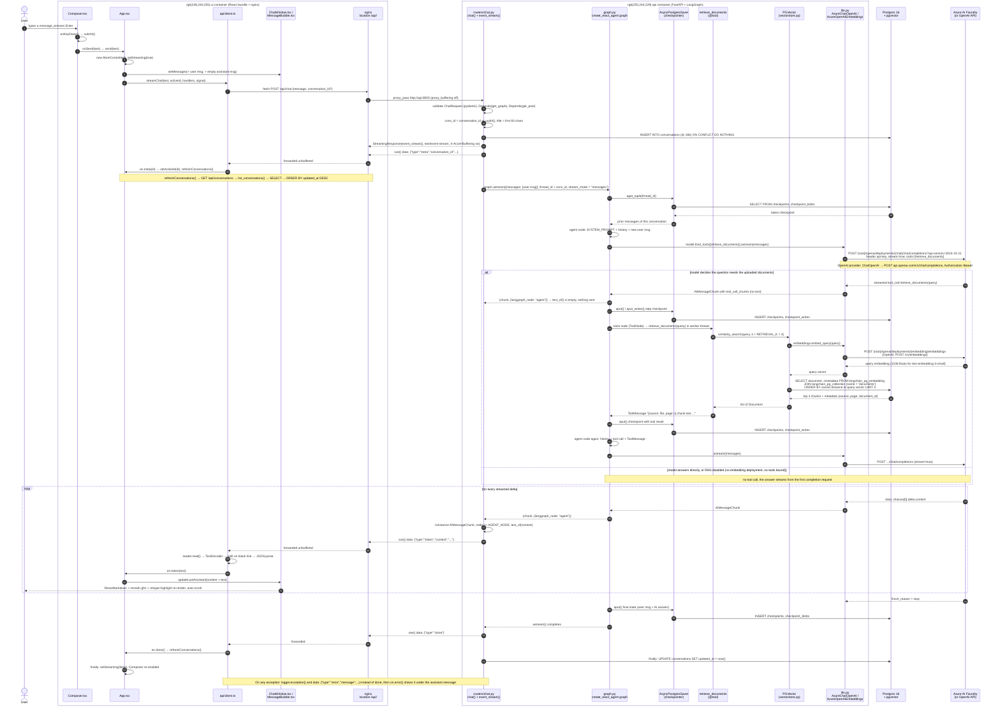

# Chat request sequence — function-level touchpoints

What happens, function by function, from the moment a user presses Enter in the UI until the streamed answer is complete. Source: [`chat-request-sequence.mmd`](diagrams/chat-request-sequence.mmd) · static image: [`chat-request-sequence.svg`](diagrams/chat-request-sequence.svg).

## Reading the diagram

| Phase | Steps | What happens |
| --- | --- | --- |
| UI send | 1–7 | `Composer` hands the text to `App.send()`, which adds the user message plus an empty assistant bubble and calls `streamChat()`. `fetch` POSTs `/api/chat` to nginx. |
| Request setup | 8–15 | nginx proxies to the API with buffering off. `chat()` validates the body, creates the conversation row if new, opens the SSE response and sends the `meta` event so the UI learns the conversation id. |
| Load memory | 16–20 | `graph.astream()` asks `AsyncPostgresSaver` for the thread's latest checkpoint, so the model sees the whole conversation. |
| First model call | 21–23 | The agent node sends system prompt + history + new message to Azure (`chat/completions`, `stream=true`) with the `retrieve_documents` tool definition attached. |
| Retrieval (alt) | 24–43 | If the model calls the tool: the query is embedded (Azure `embeddings`), pgvector returns the 4 nearest chunks by cosine distance, and the formatted chunks go back to the model as a `ToolMessage` for a second completion call. Tool-call chunks carry no text, so nothing reaches the UI in this phase. |
| Streaming | loop | Each `delta.content` becomes an `AIMessageChunk`. `event_stream()` forwards only `agent`-node text as `token` events. `client.ts` parses them and `App` appends to the last bubble, which `ReactMarkdown` re-renders. |
| Finish | last steps | The final state is checkpointed, `done` is sent, the sidebar refreshes, `updated_at` is bumped and the composer re-enables. |

Notes:

- **RAG disabled** (no `AZURE_OPENAI_EMBEDDING_DEPLOYMENT`, today's setup): the agent has no tools, so there is exactly one completion call and steps in the `alt` branch never occur.
- **OpenAI provider** (`LLM_PROVIDER=openai`): the same functions run; `llm.py` returns `ChatOpenAI` / `OpenAIEmbeddings`, which call `api.openai.com/v1/chat/completions` and `/v1/embeddings` with a Bearer token instead of the `api-key` header.
- **Stop button**: `AbortController.abort()` cancels the `fetch`; the API's `finally` block still updates `updated_at`.
